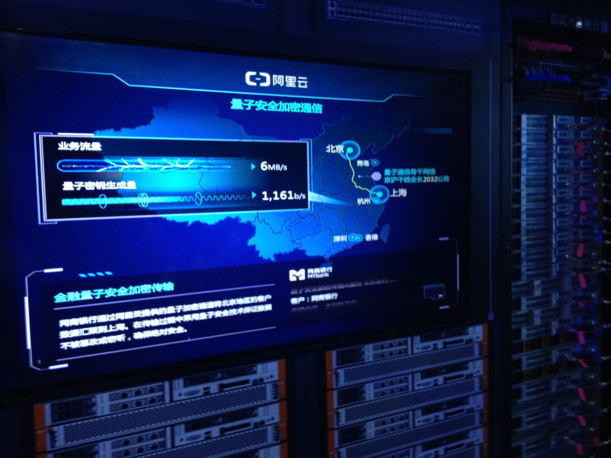
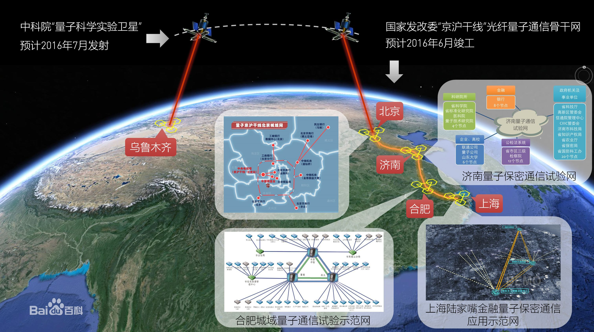
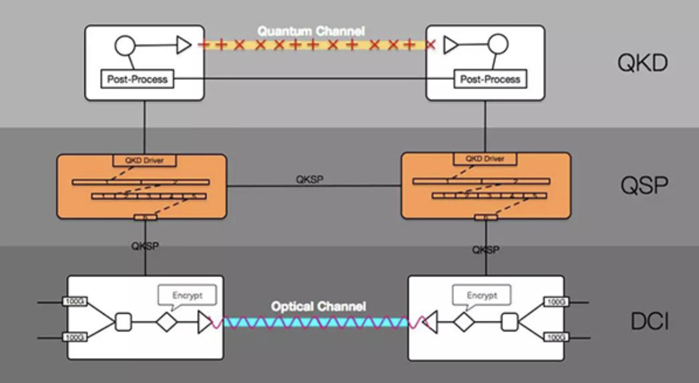

- 2018/09/19 The Computing Conference 2018
  * Alibaba DCの展示

## 調査

- Alibaba NASA
  * [计划取名NASA，马云说要储备未来20年的核心科技](http://tech.163.com/17/0313/11/CFDF3LPL00097U7R.html)
- [Alibaba DAMO Academy](https://damo.alibaba.com/)
  * [アリババ、ダモー･アカデミー（DAMO ACADEMY）を設立し、トップ科学者を集める](http://crds.jst.go.jp/dw/20171208/2017120814975/)
- Jing-Hu Trunk Line
  * [2016/04/23の記事](https://xueqiu.com/3270693275/67869514)
  * 中国語名: [京沪干线](https://baike.baidu.com/item/%E4%BA%AC%E6%B2%AA%E5%B9%B2%E7%BA%BF/17663037)
  * 
  * [China opens 2,000-km quantum communication line](http://english.gov.cn/news/photos/2017/09/30/content_281475894651400.htm)

- [QuantumCTek](http://www.quantum-info.com/index.html)
  * [“国盾出品”助力阿里巴巴部署200G高速率商用量子安全加密通信系统](http://www.quantum-info.com/News/530.html)
  * 
