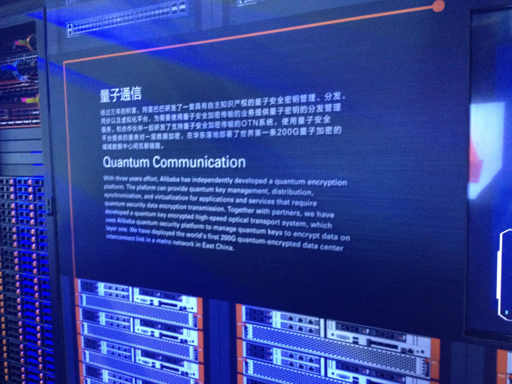
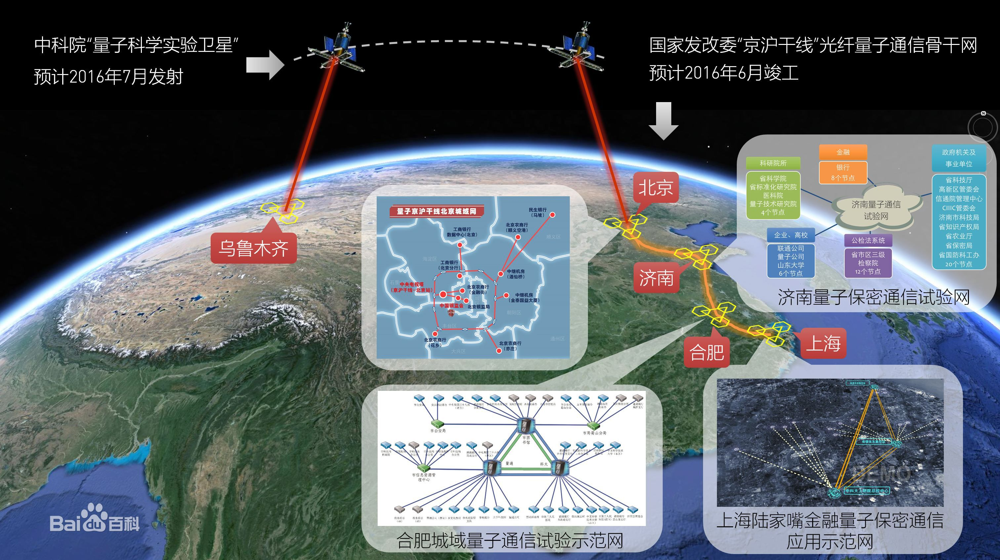
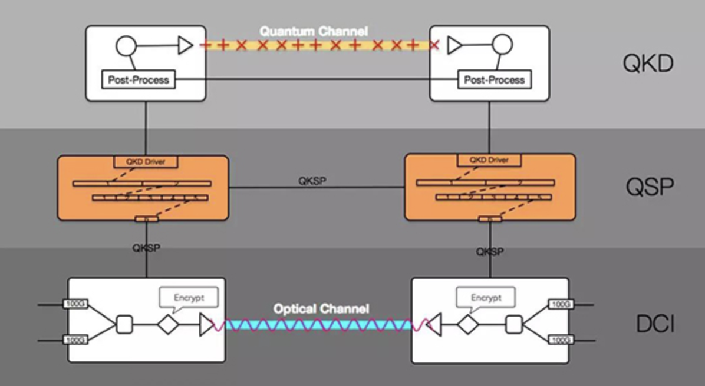

- 2018/09/19 The Computing Conference 2018
  * Alibaba DCの展示

## 調査
- 中国量子通信产业联盟
  * 2015/12
  * 国科控股，联合中科大、科大国盾量子技术股份有限公司、阿里巴巴（中国）有限公司、中国铁路网络有限公司、中兴通讯股份有限公司、北方信息技术研究所等单位，在京签署战略合作框架协议，发起成立“中国量子通信产业联盟”

作者：oversoul
链接：https://xueqiu.com/3270693275/67869514
来源：雪球
著作权归作者所有。商业转载请联系作者获得授权，非商业转载请注明出处。
- CAS-Alibaba Quantum Company Laboratory
  * 2015/07/30 設立
  * [中国科学院-阿里巴巴量子计算实验室](https://baike.baidu.com/item/%E4%B8%AD%E5%9B%BD%E7%A7%91%E5%AD%A6%E9%99%A2-%E9%98%BF%E9%87%8C%E5%B7%B4%E5%B7%B4%E9%87%8F%E5%AD%90%E8%AE%A1%E7%AE%97%E5%AE%9E%E9%AA%8C%E5%AE%A4/18238868)
- Alibaba NASA
  * [计划取名NASA，马云说要储备未来20年的核心科技](http://tech.163.com/17/0313/11/CFDF3LPL00097U7R.html)
- [Alibaba DAMO Academy](https://damo.alibaba.com/)
  * [アリババ、ダモー･アカデミー（DAMO ACADEMY）を設立し、トップ科学者を集める](http://crds.jst.go.jp/dw/20171208/2017120814975/)
- Jing-Hu Trunk Line
  * [2016/04/23の記事](https://xueqiu.com/3270693275/67869514)
  * 中国語名: [京沪干线](https://baike.baidu.com/item/%E4%BA%AC%E6%B2%AA%E5%B9%B2%E7%BA%BF/17663037)
  * 
  * [China opens 2,000-km quantum communication line](http://english.gov.cn/news/photos/2017/09/30/content_281475894651400.htm)

- [QuantumCTek](http://www.quantum-info.com/index.html)
  * [“国盾出品”助力阿里巴巴部署200G高速率商用量子安全加密通信系统](http://www.quantum-info.com/News/530.html)
  * 

- Others
  * [阿里首次公开量子通信技术： “走进了一个无人区”](https://yq.aliyun.com/articles/110611)
  * [量子通信技术、量子加密技术](https://yq.aliyun.com/articles/593022)
  * [“墨子”号登场，开启量子通信新篇章](https://yq.aliyun.com/articles/594219)
  * [阿里云实现首个云上量子加密通讯服务](https://yq.aliyun.com/articles/594191)
